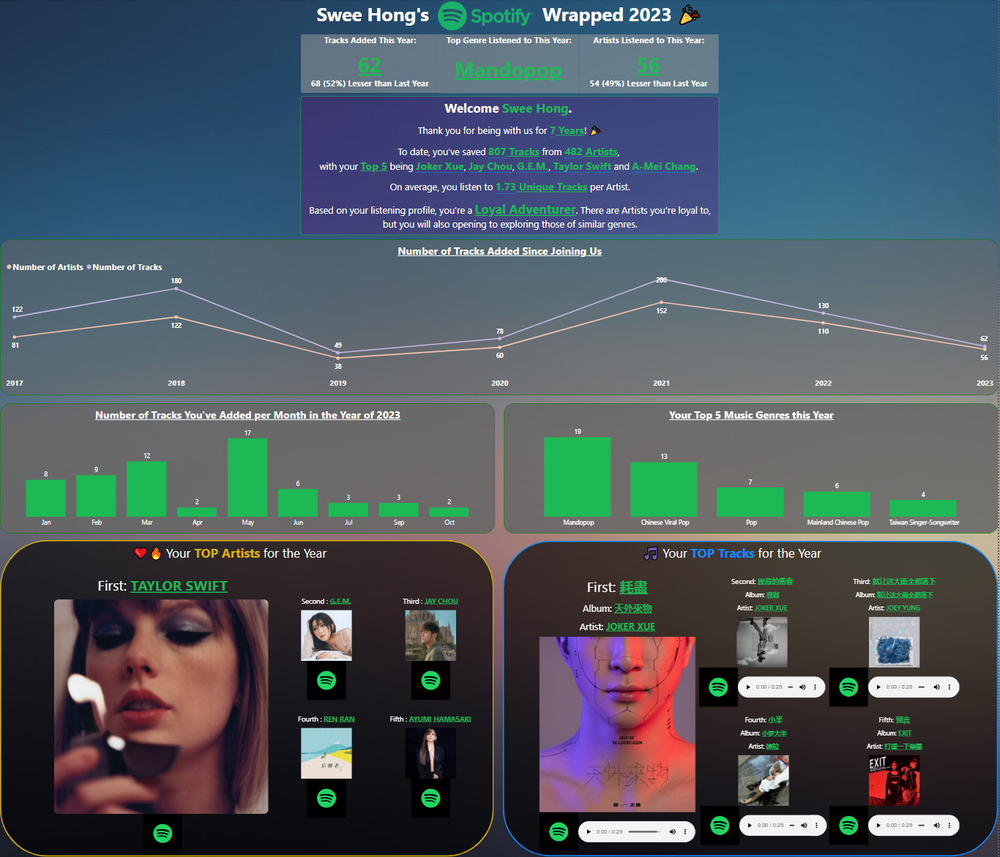

# Spotify-Wrapped-2023

Author: NG Swee Hong

Description: Personal mini-project on using Spotify API to retrieve data on user's saved tracks and top tracks/artists for the year.

Link to LinkedIn post which contains a video preview of the dashboard 

## 1. Tools/package used: 
- HTML for front-end UI. To provide users with a webpage which they can interact with, to retrieve their Data from Spotify.
- Python with Flask and Pandas package for providing a callback URL to Spotify so that users can authenticate themmselves through Spotify's Authentication process and retrieve their personal data. Pandas is for manipulation and cleaning of the data, then extraction to a csv file for dashboarding purposes in PowerBI.

## 2. Information Provided:
- The visualisation provides a generic overview of the User's Spotify Statistics such as:
  1. Tracks Added in the Current Year
  2. Top Genre Listened to in the Current Year
  3. Artists Listened to in the Current Year
- It also provides an overall summary of the User's profile, prividing information such as:
  1. How long the user has been a member of Spotify,
  2. How many tracks in total have the user added to their 'Liked Songs' playlist, along with the number of different Artists they've listened do,
  3. Top 5 artist in the playlist,
  4. Number of unique tracks per atists,
  5. The Category they belong to
     * Category was self-defined by the Author.
- A time-series chart is provided, allowing users to visualize the number of artists they've listened to and added into the playlist over their stay with Spotify, with the ability for them to drill down into a specific year of interest.
- Focusing on 2023, a bar chart on the number of tracks added in various months through the year and the Top 5 Genres/Artists/Tracks for the year is also available.
- Lastly, users can interact with the Spotify logo or the music player in the TOP Artists and TOP Tracks sections, which would allow users to be redirected to an artist's Spotify or track page when clicked. Users are also able to listen to a preview of the tracks.

## 3. Dashboard preview:

